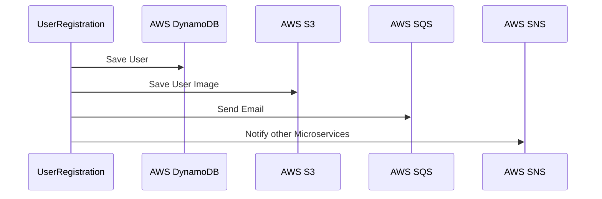

---
title: "What is AWS? A High-Level Overview of the Most Important AWS Services"
categories: [craft]
date: 2020-06-30 06:00:00 +1100
modified: 2020-06-30 06:00:00 +1100
author: pratikdas
excerpt: "This article describes localstack a useful aid to test your aws services locally."
image:
  auto: 0072-aws
---
We access various AWS services, while building applications - for example, upload file in S3, store some data in dynamodb, send message to SQS, etc.  Setting up a development environment for using these services is complex and time consuming. Instead we use Localstack to first develop and unit test our applications with mock implementations of these services. We switch to the real services only in the integration environment.
 
# Why Localstack
The method of temporarily using dummy objects in place of actual ones is a time tested way of doing unit testing applications having external dependencies, most appropriately called [Test Doubles](http://xunitpatterns.com/Test%20Double.html) .
We implement Test Double of our AWS services with Localstack. 
Some other methods of doing this-
Manual - Using a mock object with frameworks  like mockito during unit testing.
Do it yourself - Using a home grown solution deployed as a service.

Localstack gives a good alternative to these approaches.
1. With Localstack we can run our applications without connecting to AWS.
2. Avoid the complexity of AWS configuration and focus on development.
3. Integrate localstack in our devops pipeline. 
4. Enrich our test leveraging localstack's integration testcontainers and JUnit runner and a JUnit 5 extension
5. error scenarios can be configured

# How this works

LocalStack is written in python as a http request processing application listening on specific ports.  We access AWS services from CLI and from our applications using AWS SDK (Software Development Kit).
Both the SDK and the CLI gives on option of overriding the url of AWS API. We access localstack by overriding the url in local environment.
We do this in AWS CLI using commands like this:
```
aws s3 --endpointurl 
```

Using SDK our code looks similar to this taking S3 as an example - 
```java
		URI endpointOverride = new URI("http://localhost:4566");
		S3Client s3 = S3Client.builder().endpointOverride(endpointOverride ).region(region).build();
```

**************
The AWS SDK (Software Development Kit) is an integral part of a developer's toolset for building applications with AWS services. The SDK provides client libraries in all the popular programming languages like java, node js, python for accessing various AWS services. It essentially does the heavy-lifting of securely connecting to the AWS services.

During initial days of development it helps to focus on writing code for the application instead of spending time on setting up the environment for AWS connectivity. It often gets tedious when you are working in a controlled environment where you need to request access from other teams.

# How to set up
We run Localstack either as a python application using our local python installation or alternately using a docker image. 
Method 1
pip install localstack
localstack start
This starts a docker container
Sample output
Attach console image
[](/assets/img/posts/aws-localstack/localstackconsole.png)

 I will use the docker image with the below environment variables:

I have enabled S3 and DynamoDB services.

We will use a spring boot application and switch using profile .

# Example

Create an S3 bucket in CLI

You can see here the sequence diagram of our user registration API. As input to the API, the user will provide his/her information in the form of first name, last name, email and mobile and also upload a profile picture. Our API will save the record in DynamoDB, the profile pic in S3, send an email by putting a message in a SQS queue and publish a "User Created" message to a SNS topic to notify interested consumer microservices.


## Create your microservice with Spring Boot
I started by creating a Spring boot rest api using start.spring.io with minimum dependencies for web, and lombok.
I added the AWS SDK dependencies for S3,DynamoDB, SQS and SNS to the pom.xml of the application generated in previous step.
I created the controller class containing the endpoint and a service class for invoking the AWS services.
Finally I created 2 test classes 1 for testing my endpoint and other for the service class. I used 2 profiles- local - for testing using Localstack and integration for testing with AWS services.


## Run using Localstack

Edit docker compose yaml to enable services for SQS,SNS,S3 and DynamoDB
Start Localstack .
Run junit

## Run using AWS

Create AWS resources using cloudformation. I prefer this approach instead of creating the resources individually from console since I can tear up and recreate the resources. It allows me to clean up all resources with a single command at the end of the exercise.
// TODO cloudformation yaml link

This is the step you save in the beginning during development or someone else can work on this while you are writing your code.

Set up your default profile. Advice repeated ad-nauseum - Do not hard code credentials in code. I have used the credentialchain which checks available credentials in sequence. To make it more secure you can use STS.

Finally we run our spring boot app connected to AWS by switching to integration profile.


## Clean up

You can delete the current file by clicking the **Remove** button in the file explorer. The file will be moved into the **Trash** folder and automatically deleted after 7 days of inactivity.

# Conclusion

We saw how to use localstack for testing the integration of our application with AWS services locally. Localstack also has an enterprise version available with a more services. I hope this will help you to have more fun with working with AWS services in your local environment without bothering about AWS permissions and incurring cost.

