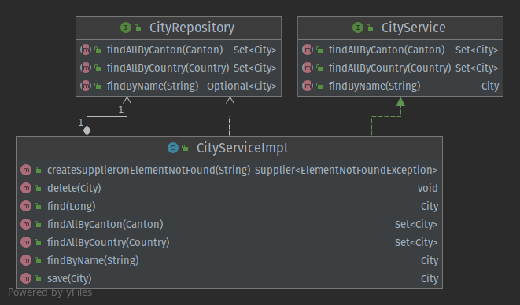

In this article we will learn how to mock objects with Mockito. We'll first talk about what test doubles are and then
how we can use them to create meaningful and tailored unit tests. We will also have a look at the most important
Dos and Dont's while writing clean unit tests with Mockito.



## Introduction to Mocks

The basic concept of mocking is replacing real objects with doubles. We can control how these doubles behave. These
doubles we call *test doubles*. We'll cover the different kinds of test doubles later in this article.

Let's imagine we have a service that processes orders from a database. It's very cumbersome to set up a whole database just
to test that service. To avoid setting up a database for the test, we create a *mock* that pretends to be the database,
but in the eyes of the service it looks like a real database. We can advise the mock exactly how it shall behave. Having
this tool, we are able to test the service but don't actually need a database.

Here [Mockito](https://www.mockito.org) comes into play. Mockito is a very popular library that allows us to create such
mock objects.

Consider reading the section [Why Mock?](https://reflectoring.io/spring-boot-mock/#why-mock) for additional information
about mocking.

## Different Types of Test Doubles

In the world of code, there are many different words for test doubles and definitions for their duty. I recommend to
define a common language within the team.

Here is a little summary of the different types for test doubles and how we use them in this article:

| Type  | Description                          |
| ----- | ------------------------------------------------------------ |
| Stub  | A stub is an object that always returns the same value, regardless of which parameters you provide on a stub's methods. |
| Mock  | A mock is an object whose behaviour - in the form of parameters and return values - is declared before the test is run. (This is exactly what Mockito is made for!) |
| Spy   | A spy is an object that logs each method call that is performed on it (including parameter values). It can be queried to create assertions in order to verify the behaviour of the system under test. (Spies are supported by Mockito!) |

## Mockito in Use

Consider following example:



The green arrow with the dotted line and filled triangle stands for *implements*. `CityServiceImpl` is the
implementation of `CityService` and therefore *an instance of* `CityService`. 

The white arrows with the diamond says
that `CityRepository` *is part of* `CityService`. It is also known as *composition*. 

The remaining white arrow with the
dotted line stands for the fact that `CityServiceImpl` owns *a reference* to `CityRepository`.

**We don't want to consider the `CityRepository` implementation when unit testing `CityServiceImpl`**. If we used a real `CityRepository` implementation in the test, we would have to connect it to a database, which makes the test setup more complicated and would increase the number of reasons why our test could fail, since we have added complexity in our test fixture
with potentially failing components.

Here Mockito comes to the rescue! Mockito allows us to create a suitable test double for the `CityRepository` interface and lets us define the behaviour we expect from it. Applying this possibility we can create meaningful unit
tests to ensure the correct behaviour of the service.

**In summary, what we want is a simple, fast and reliable unit test instead of a potentially complex, slow and flaky
test!**

Let's look at an example:

```java
class CityServiceImplTest {

  // System under Test (SuT)
  private CityService cityService;

  // Mock
  private CityRepository cityRepository;

  @BeforeEach
  void setUp() {
    cityRepository = Mockito.mock(CityRepository.class);
    cityService = new CityServiceImpl(cityRepository);
  }

  // Test cases omitted for brevity.

}
```

The test case consists of the system under test `CityService` and its dependencies. In this case, the only dependency 
is an instance of `CityRepository`. We need those references in oder to test the expected behaviour and reset the test double to not
interfere with other test cases (more about that later).

Within the setup section, we create a test double with `Mockito.mock(<T> classToMock)`. Then, we inject this test double
into the `CityServiceImpl` constructor so that its dependencies are satisfied. Now we are ready to create the test cases:

```java
class CityServiceImplTest {

  // System under Test (SuT)
  private CityService cityService;

  // Mocks
  private CityRepository cityRepository;

  @BeforeEach
  void setUp() {
    cityRepository = Mockito.mock(CityRepository.class);
    cityService = new CityServiceImpl(cityRepository);
  }

  @Test
  void find() throws ElementNotFoundException {
    City expected = createCity();
    Mockito.when(cityRepository.find(expected.getId()))
        .thenReturn(Optional.of(expected));
    City actual = cityService.find(expected.getId());
    ReflectionAssert.assertReflectionEquals(expected, actual);
  }

  @Test
  void delete() throws ElementNotFoundException {
    City expected = createCity();
    cityService.delete(expected);
    Mockito.verify(cityRepository).delete(expected);
  }

}
```

Here we have two example test cases. 

The first one is about finding a city via the `CityService`. Therefore, we create an instance of `City`. This city is
the object which we expect to be returned from the `CityService`. Now we have to advise the repository to return that
value, if and only if the declared ID has been provided.

Since `cityRepository` is a Mockito mock, we can declare its behaviour with `Mockito.when()`. Now we can call
the `find()` method on the service, which will return an instance of `City`. 

Having the expected and th actually returned `City` objects, we can create a
corresponding assertion.

In case a method has no return value (like `cityService.delete()` in the code example), we can't create an assertion on
the return value. Here Mockito's spy features comes into play.

We can query the test double and ask if a method was called with the expected parameter. This is what `Mockito.verify()`
does.

**These two features - mocking return values and verifying method calls on test doubles - give us a
huge possibility to create various simple test cases**. Also, the shown examples can be used for test driven development
and regression tests. Mockito fits both needs!

## How to Create Mocks with Mockito

Until now, we have seen how to create fast and simple test cases. Now let's look at the different ways of creating mocks
for our needs. Before we'll continue, we must understand what kind of test double Mockito creates.

Mockito creates test doubles of the type *mock*, but they have some features of a *spy*. These extra features allow us
to verify if a certain method was called after we executed our test case. More about that later.

### Creating Mocks with Plain Mockito

Let's continue with the first variant to create a mock with Mockito. This variant doesn't require any framework or
annotations. It is applicable in every project where we have included Mockito.

```java
CityRepository cityRepository = Mockito.mock(CityRepository.class);
CityService cityService = new CityServiceImpl(cityRepository);
```

We can simply declare a variable with the type of the component we want to mock. Taking the example from above, we want
`CityRepository` to be a mock, so that we don't have to rely on its dependencies (like a database). The mock is then passed to the
service, which is the *system under test*.

That's all we need to set up our first mock with Mockito!

### Initializing Mocks with Mockito Annotations

In case we have multiple dependencies that must be mocked, it gets cumbersome to create each and every mock manually
with the variant shown above. So, we can also create mocks by using the `@Mock` annotation:

```java
class CityServiceImplTestMockitoAnnotationStyle {

  // System under Test (SuT)
  private CityService cityService;

  // Mocks
  @Mock
  private CityRepository cityRepository;

  @BeforeEach
  void setUp() {
    MockitoAnnotations.openMocks(this);
    cityService = new CityServiceImpl(cityRepository);
  }

}
```

We can annotate each field to be a mock with the annotation of `@Mock`. Annotating them doesn't initialize them yet. To
do so, we call `MockitoAnnotations.openMocks(this)` in the `@BeforeEach` section of our test. The annotated fields of the
provided object are then initialized and ready to use, which is in our case is the class instance itself (`this`). We don't have to deal
with boilerplate code anymore and are able to keep our unit tests neat and concise.

### Using JUnit Jupiter's `MockitoExtension`

As an alternative to the Mockito annotation style we can make use of JUnit Jupiter's `@ExtendWith` and extend JUnit
Jupiter's context with `MockitoExtension.class`:

```java
@ExtendWith(MockitoExtension.class)
class CityServiceImplTestMockitoJUnitExtensionStyle {

  // System under Test (SuT)
  private CityService cityService;

  // Mocks
  @Mock
  private CityRepository cityRepository;

  @BeforeEach
  void setUp() {
    cityService = new CityServiceImpl(cityRepository);
  }

}
```

The extension assumes the initialization for annotated fields, so we must not do it ourselves. This makes our setup even
neater and conciser!

### Injecting Mocks with Spring

If we have a more complex test fixture, and we want to inject the mock into Spring's `ApplicationContext` we can make
use of `@MockBean`:

```java
@ExtendWith(SpringExtension.class)
class CityServiceImplTestMockitoSpringStyle {

  // System under Test (SuT)
  private CityService cityService;

  // Mocks
  @MockBean
  private CityRepository cityRepository;

  @BeforeEach
  void setUp() {
    cityService = new CityServiceImpl(cityRepository);
  }

}
```

But caution: `@MockBean` is not an annotation from Mockito but from Spring! In the startup process Spring places the
mock in the context, so that we don't need to do it ourselves. Wherever a bean requests to have its dependency satisfied,
Spring injects the mock instead of the real object. This becomes handy if we want to have the same mock in different
places.

See [Mocking with Mockito and Spring Boot](https://reflectoring.io/spring-boot-mock/#mocking-with-mockito-and-spring-boot)
for a deep dive how to mock Beans in Spring Boot.

## Defining the Behaviour of Mocks

In this section we have a look at how to define the behaviour of the mocks in our test. What we have seen until now is
what mocks are used for and how to create them. We are ready to use them in our test cases.

### How to Return an Expected Object

The probably most common case when using Mockito is to return expected objects. If we call `findByName(name)` of `CityService`
we would expect that the argument for `name` is forwarded to the repository which returns an `Optional` of a `City`. The
service unpacks the `Optional` if present or otherwise throws an exception.

```java
  @Test
  void findByName() throws ElementNotFoundException {
    City expected = createCity();
    Mockito.when(cityRepository.findByName(expected.getName()))
      .thenReturn(Optional.of(expected));
    City actual=cityService.findByName(expected.getName());
    ReflectionAssert.assertReflectionEquals(expected,actual);
  }
```

We first create the expected object for `City`. Having that expected instance for a `City`, we can define the behaviour
of the mock which is in that case to return the `Optional` of the expected instance. We do so by
calling `Mockito.when()` with the call we want to make. As a last step we must declare the return value of that call at
the end of the method chain.

If we try to find the expected city by its name, the service will return the previously declared object without throwing
an exception. We can assert that the expected `City` equals the actual `City` from the service.

### How to Throw an Exception

Mockito gives us developers also the possibility to throw exceptions instead of returning a value. This is mostly used
to test error handling blocks in our code.

```java
  @Test
  void findByNameThrowsExceptionIfCityNameContainsIllegalCharacter() {
    String cityName="C!tyN@me";
    Mockito.when(cityRepository.findByName(cityName))
      .thenThrow(IllegalArgumentException.class);
    Assertions.assertThrows(IllegalArgumentException.class,
      () -> cityService.findByName(cityName));
  }
```

Declaring the behaviour only differs by the last call in the method chain. With `thenThrow()`, we advise Mockito to throw an
`IllegalArgumentException` in this case. 

In our case, we just assert that our `CityService` implementation re-throws the exception.

### How to Verify a Method Call

We can't advise Mockito to return a value on `void` methods. In this case it is better to assert an underlying component
was called. This can be achieved by using `Mockito.verify()`:

```java
  @Test
  void delete() throws ElementNotFoundException {
    City expected = createCity();
    cityService.delete(expected);
    Mockito.verify(cityRepository).delete(expected);
  }
```

In this example, it isn't necessary to declare the behaviour of the mock beforehand. Instead, we just query the mock if it has been
called during the test case. If not, the test case fails.

## Mockito Best Practices

Knowing how to create the mocks, let's have a look at some best practices to keep our tests clean and maintainable. It
will save us much time debugging and doesn't let our team members guess what the intent of the test case is.

### Don't Share Mock Behavior Between Tests

We might be tempted to put all behavior declarations using `Mockito.when()` into a setup method that runs before each test (i.e. annotated with `@BeforeEach`) 
to have them in a common place. Even though this reduces the test cases to a minimum, the readability suffers a lot:

```java
  @BeforeEach
  void setUp() {
    expected = createCity();
    cityRepository = Mockito.mock(CityRepository.class);
    cityService = new CityServiceImpl(cityRepository);

    // Avoid such complex declarations
    Mockito.when(cityRepository.save(expected))
        .thenReturn(Optional.of(expected));
    Mockito.when(cityRepository.find(expected.getId()))
        .thenReturn(Optional.of(expected));
    Mockito.when(cityRepository.findByName(expected.getName()))
        .thenReturn(Optional.of(expected));
    Mockito.when(cityRepository.findAllByCanton(expected.getCanton()))
        .thenReturn(Collections.singleton(expected));
    Mockito.when(cityRepository.findAllByCountry(expected.getCanton().getCountry()))
        .thenReturn(Collections.singleton(expected));
  }
```

This will get us simple test cases like this, because we don't have to define the behavior in each test case:

```java
  @Test
  void save() throws ElementNotFoundException {
    ReflectionAssert.assertReflectionEquals(expected, cityService.save(expected));
  }

  @Test
  void find() throws ElementNotFoundException {
    ReflectionAssert.assertReflectionEquals(expected, cityService.find(expected.getId()));
  }

  @Test
  void delete() throws ElementNotFoundException {
    cityService.delete(expected);
    Mockito.verify(cityRepository).delete(expected);
  }
```

But, because all mocking behavior is in a central place, we must pay attention to not break any  test cases when modifying this central code. Also, we don't know which test case requires which behavior when reading the test case. We have to guess or investigate the actual code to find out.

We better declare the behaviour for each test case in isolation, so that the test cases are independent of each other. The code from above should be refactored to something like the following:

```java
  @BeforeEach
  void setUp() {
    cityRepository = Mockito.mock(CityRepository.class);
    cityService = new CityServiceImpl(cityRepository);
  }
  
  @Test
  void save() throws ElementNotFoundException {
    City expected = createCity();
    Mockito.when(cityRepository.save(expected))
      .thenReturn(Optional.of(expected));
    City actual=cityService.save(expected);
    ReflectionAssert.assertReflectionEquals(expected,actual);
  }
  
  @Test
  void find() throws ElementNotFoundException {
    City expected = createCity();
    Mockito.when(cityRepository.find(expected.getId()))
      .thenReturn(Optional.of(expected));
    City actual=cityService.find(expected.getId());
    ReflectionAssert.assertReflectionEquals(expected,actual);
  }
  
  @Test
  void delete() throws ElementNotFoundException {
    City expected = createCity();
    cityService.delete(expected);
    Mockito.verify(cityRepository).delete(expected);
  }
```

If we explicitly want to re-use a certain mock behavior in multiple test cases, we can move it into special methods like this:

```java
  void givenCityExists(City city) throws ElementNotFoundException {
    Mockito.when(cityRepository.find(city.getId()))
    .thenReturn(Optional.of(city));
  }

  @Test
  void find() throws ElementNotFoundException {
    City expected = createCity();
    givenCityExists(expected);
    City actual=cityService.find(expected.getId());
    ReflectionAssert.assertReflectionEquals(expected,actual);
  }
```

We can then use these methods in the test cases like above. **It's important to make methods with shared mock behavior very specific and name them properly to keep the test cases readable**.

### Write Test Cases Independently

Don't expect test cases to be always executed in the same order! We write everything that belongs to our test case into 
the test method, so that a test case can be executed alone in our IDE or all together within our CI!

This mistake often comes together with setup blocks that declare behavior shared between test methods. If we need to add a new behavior at the end of the
block, each previous declaration must be executed before we are able to call ours. Or vice versa: if a new declaration
is inserted at the beginning, causes a shift of all other declarations towards the end. At least now our alarm bell
should ring, and it's time to reconsider our test case!

### Avoid `Mockito.reset()` for Better Unit Tests

Mockito recommends in their documentation to prefer recreation of mocks over resetting them:

> Smart Mockito users hardly use this feature because they know it could be a sign of poor tests.
> Normally, you don't need to reset your mocks, just create new mocks for each test method.

We better create simple and small test cases than lengthy and over-specified tests. The cause of such tests might be
testing too much in a single unit test. But let's look at an example for this situation:

```java
  @Test
  void findAndDelete() throws ElementNotFoundException {
    City expected = createCity();
    Mockito.when(cityRepository.find(expected.getId()))
      .thenReturn(Optional.of(expected));
    City actual = cityService.find(expected.getId());
    ReflectionAssert.assertReflectionEquals(expected,actual);
    cityService.delete(expected);
    Mockito.verify(cityRepository).delete(expected);
    Mockito.reset(cityRepository);
    Mockito.when(cityRepository.find(expected.getId()))
      .thenReturn(Optional.empty());
    Assertions.assertThrows(ElementNotFoundException.class,
      () -> cityService.find(expected.getId()));
  }
```

What is this test case doing?

1. Tries to find a city and asserts that it's equal to the expected city
2. Deletes a city and a verifies the delete method on the repository has been called
3. Tries to find the previously created city again but expecting an exception.

This test case's design is unfortunate. It tests too much and could be split in simpler and smaller units:

```java
  @BeforeEach
  void setUp() {
    cityRepository = Mockito.mock(CityRepository.class);
    cityService = new CityServiceImpl(cityRepository);
  }
  
  @Test
  void find() throws ElementNotFoundException {
    City expected = createCity();
    Mockito.when(cityRepository.find(expected.getId())).thenReturn(Optional.of(expected));
    City actual = cityService.find(expected.getId());
    ReflectionAssert.assertReflectionEquals(expected,actual);
  }
  
  @Test
  void delete() throws ElementNotFoundException {
    City expected = createCity();
    cityService.delete(expected);
    Mockito.verify(cityRepository).delete(expected);
  }
  
  @Test
  void findThrows () {
    City expected = createCity();
    Mockito.when(cityRepository.find(expected.getId())).thenReturn(Optional.empty());
    Assertions.assertThrows(ElementNotFoundException.class,()->cityService.find(expected.getId()));
  }
```

Now each test is simple and easy understandable. We don't have to reset the mocks anymore, since this is achieved in
the `setUp()` method. The effectively tested code is the same but a lot more meaningful than before.

### Don't Mock Collections or Value Objects

Mockito is a framework to mock objects with behaviour that can be declared at the beginning of our test. It is common to
have *Data Transfer Objects* (or DTOs). The intent of such a DTO is, as its name says, to transport data from a source
to a destination. In order to retrieve this data from the object, we could declare the behaviour of each getter. Albeit
this is possible, we should rather use real values and set them to the DTO. The same rule applies for collections too,
since they are container for values as well.

**Mockito is a framework to mock behaviour of components based on values and not to mock values.** This means that we
better create tests for components that process DTOs rather than for the DTOs themselves.

### Testing Error Handling with Mockito

```java
Mockito.when(cityRepository.find(expected.getId()))
   .thenThrow(RuntimeException.class);
```

Mockito comes with a built-in mechanism to test our error handling. Instead of declaring a return value, advise Mockito
to throw the expected exception. In case we throw checked exceptions, the compiler doesn't let us throw checked
exceptions that are not declared on the method.

### Mocking `void` Methods

```java
// Causes a compiler error
Mockito.when(cityRepository.delete())
  .thenThrow(RuntimeException.class);
```

In case we want to declare a special behaviour for `void` methods, we must change our approach. The compiler doesn't
like void methods in brackets, since they have no arguments. Change our approach to following:

```java
Mockito.doThrow(RuntimeException.class)
  .when(cityRepository).delete(expected);
```

### Verify the Number of Method Calls

```java
Mockito.verify(cityRepository, Mockito.times(1)).delete(expected);
```

We can verify how many times a mock was called by simply use the built-in `verify()` method. If the condition is not met,
our test case will fail. This is extremely handy for algorithms or similar processes. There are other predefined
verification modes such as `atLeastOnce()` or `never()` already present and ready to use!

## Mockito FAQ

In this section we want to point out important things which are nice to know.

* **What types can I mock?** Mockito allows us to mock not only interfaces but also concrete classes.
* **What is returned if I don't declare a mock's behaviour?** Mockito by default returns `null` for complex objects, and the
  default values for primitive data types (for example `0` for `int` and `false` for `boolean`)
* **How many times does Mockito return a previously declared value?** If we have declared a return value once, Mockito returns always the same value, regardless of
  how many times a method is called. If we have multiple calls to `Mockito.when()` with different return values, the first method call will return the first declared value, the second method call the second value, and so on.
* **Can I mock `final` classes?** No, final classes **can't** be mocked and neither can final methods. This has
  to do with the internal mechanism of how Mocktio creates the mock and the Java Language Specification. If we want to
  do so, we can use [PowerMock](https://github.com/powermock/powermock).
* **Can I mock a constructor?** Mockito can't mock constructors, static methods, `equals()` nor `hashCode()` out of the box.
  In order to achieve that, [PowerMock](https://github.com/powermock/powermock) must be used.

## Pros and Cons

Mockito helps us to create simple mocks fast. The Mockito API is easy to read, since they are written in
fluent style. Mockito can be used in plain Java projects or together with frameworks such as Spring Boot. It is well
documented and has lots of examples in it. In case of problems there is a huge community behind it and questions are
answered frequently on StackOverflow. It disposes great flexibility to its users which can contribute their ideas, since
it is an open source project. Therefore, the development is ongoing, and the project is maintained.

Mockito can't mock everything out of the box. In case we want to mock `final` or `static` methods, `equals()` or the
construction of an object, we need [PowerMock](https://github.com/powermock/powermock).

## Conclusion

In this post we learned how to create mocks for unit tests in various variants. Mockito gives us a lot of flexibility,
and the freedom to choose between numerous tools to achieve our goals. When working in teams, we define a common
language and Mockito code style guideline how we want to use this powerful tool for testing. This will improve our
performance and helps to discuss and communicate.

Although Mockito comes with a lot of features, be aware of its restrictions. Don't spend time to make the impossible
possible, better reconsider our approach to test a scenario.

You will find all examples on [GitHub](https://github.com/silenum/mockito-examples).
