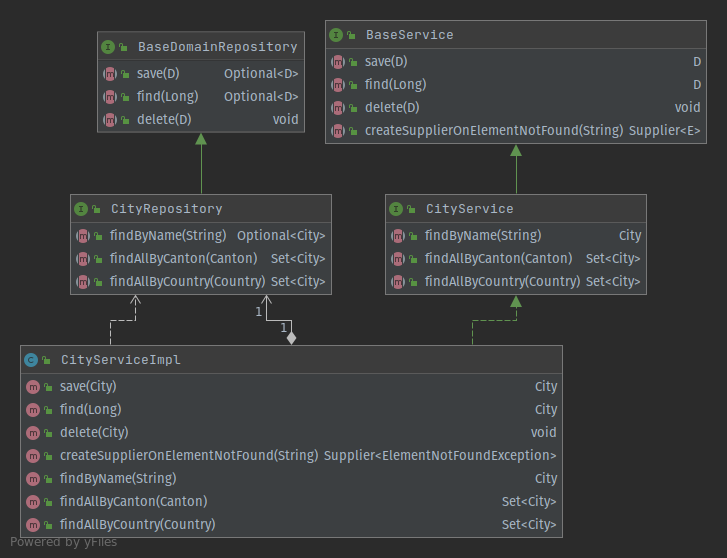



Mockito allows you to write meaningful and tailored unit tests in Java. It is widely in use, since it is that easy to
apply to *mock away* unused dependency to create a suitable fixture for your unit test! In this article we will face how
to use Mockito, what are Dos and Don'ts and learn how to improve your unit test cases.

## Introduction to Mocks

Before we start talking about *Mocks*, we need to understand what *Test Doubles* are. Test Doubles are like stuntmen for
your test cases. They make the hard work for you while you are shining, doing the nice work. So mocking is used, when we
want to replace real objects with mocks, whose behaviour is under full control, so that we can advise them what to do.

Here comes [Mockito](https://www.mockito.org) into play. Mockito is a very popular library to support such testing
scenarios. Spring also uses Mockito and has own adaptors that provide easy handling for users. Don't worry - you must
not have Spring to use Mockito. Mockito also comes with a standalone library that can be referenced within your build
tool such as Maven and Gradle.

Consider reading the article [Why Mock?](https://reflectoring.io/spring-boot-mock/#why-mock) for additional information
about Mocking.

## Test Doubles and Their Duty

In the world of code, there are lots of words for Test Doubles and definitions for their duty. I recommend you to define
a common language, if different understanding within your team persist.

Here is a little summary of the different types for Test Doubles and how I use them:

| Type  | Description                                                  |
| ----- | ------------------------------------------------------------ |
| Dummy | A dummy is an object, that is oftenly used as a parameter for the method under test but without an actual need of it during the test itself. |
| Fake  | A fake is an object, that has an implementation, but which is restricted and simpler as the real implementation. Due to this restriction, the object is not meant to use in production. |
| Stub  | A stub is an object, that always returns the same value, regardless of which parameters you provide on a stub's methods. |
| Mock  | A mock is an object, whose behaviour previously was declared, before the test is run. (This is exactly what Mockito is made for!) |
| Spy   | A spy is an object, that protocols calls and arguments. It can be queried to create assertions in order to verify the behaviour of the system under test. (Spies are supported by Mockito!) |

Per default Mockito creates mocks of the type *Spy* !

## Mockito in Use

Consider following example:



In order to test the `CityServiceImpl` we would need an implementation for `CityRepository` to test the service. Then
again, the `CityRepository` has further dependencies to other components to the database and potentially to other
systems and further components.

Unfortunately, we **cannot** consider all those components as bug-free and working as expected. By chance, we include
even more complexity so that there are numerous reasons that our test is going to fail. In Spring, you might think to
extend your unit test to a Spring Boot Test applying `@SpringBootTest`. Apart from the performance issue you ignore
there, what is the suitable solution for non-Spring projects?

Here comes Mockito to the rescue! Mockito allows me to just create the suitable test double instead of creating all
those rat-tail objects for the real implementation.

**In summary, what you want is a simple, fast and reliable unit test instead of a potentially complex, slow and flaky
one!**

Let's see an example:

```java
class CityServiceImplTest {

    // System under Test (SuT)
    private CityService cityService;

    // Mocks
    private CityRepository cityRepository;

    @BeforeEach
    void setUp() {
        cityRepository = Mockito.mock(CityRepository.class);
        cityService = new CityServiceImpl(cityRepository);
    }

    // Test cases omitted for brevity.

}
```

The test case consists of the system under test `CityService` and its dependencies. In this case, this
is `CityRepository`. We need those references in oder to test the expected behaviour and reset the test double to not
interfere with other test cases (more about that later).

Within the setup section, we create the double as previously explained with `Mockito.mock(<T> classToMock)`. Then, we
inject this double into the `CityService` so that its dependencies are satisfied. Now we are ready to create the test
cases.

```java
class CityServiceImplTest {

    // System under Test (SuT)
    private CityService cityService;

    // Mocks
    private CityRepository cityRepository;

    @BeforeEach
    void setUp() {
        cityRepository = Mockito.mock(CityRepository.class);
        cityService = new CityServiceImpl(cityRepository);
    }

    @Test
    void find() throws ElementNotFoundException {
        City expected = createCity();
        Mockito.when(cityRepository.find(expected.getId()))
                .thenReturn(Optional.of(expected));
        City actual = cityService.find(expected.getId());
        ReflectionAssert.assertReflectionEquals(expected, actual);
    }

    @Test
    void delete() throws ElementNotFoundException {
        City expected = createCity();
        cityService.delete(expected);
        Mockito.verify(cityRepository).delete(expected);
    }

}
```

Here we have two exemplary test cases. The first one is about finding a city via the `CityService`. Therefore, we create
an instance of `City`. This city is considered as the city which is expected to be returned from the `CityService`. Now
we have to advise the repository to return that value, if and only if the declared ID has been provided.
Since `cityRepository` is a Mockito mock, we can declare its behaviour. Now we can call the `save` method on the
service, which will return an instance of city. Having those two object, we can create a corresponding assertion.

In case there is no return value present, the object's equality cannot be asserted. Here Mockito's Spy comes into play.
The test double can be queried, if a method was called with the expected parameter. This is what `Mockito.verify()`
does. Those two test cases are widely used and give you a huge possibility to create various simple test cases. Also,
the shown examples can be used for test driven development and regression tests. Mockito fits both needs!

## How to Create Mocks with Mockito

Until now, we have seen how to create quickly fast and simple test cases. Now let's face the possibilities to create the
mocks for our needs.

### Plain Mockito

In case you don't want to use any framework nor annotations, you can create the mocks you need as follows:

```java
ClassToMock mock = Mockito.mock(ClassToMock.class);
```

That's all you need to create a mock with Mockito!

### Mockito Annotation Style

```java
class CityServiceImplTestMockitoAnnotationStyle {

    // System under Test (SuT)
    private CityService cityService;

    // Mocks
    @Mock
    private CityRepository cityRepository;

    @BeforeEach
    void setUp() {
        MockitoAnnotations.openMocks(this);
        cityService = new CityServiceImpl(cityRepository);
    }

}
```

If the system under test has several dependencies that must be mocked, it gets cumbersome to create all these mocks with
the variant shown above. You can annotate them with `@Mock` and initialize them all at once. Applying this variant, you
don't have to deal with boilerplate code and are able to keep you unit test neat and concise.

### Mockito JUnit Extension Style

```java

@ExtendWith(MockitoExtension.class)
class CityServiceImplTestMockitoJUnitExtensionStyle {

    // System under Test (SuT)
    private CityService cityService;

    // Mocks
    @Mock
    private CityRepository cityRepository;

    @BeforeEach
    void setUp() {
        cityService = new CityServiceImpl(cityRepository);
    }

}
```

An alternative to the Mockito Annotation Style you can make use of JUnit Jupiter's `@ExtendWith` and extend the
Jupiter's context with `MockitoExtension.class`.

This makes your setup even neater and conciser!

### Mockito Spring Style

```java

@ExtendWith(SpringExtension.class)
class CityServiceImplTestMockitoSpringStyle {

    // System under Test (SuT)
    private CityService cityService;

    // Mocks
    @MockBean
    private CityRepository cityRepository;

    @BeforeEach
    void setUp() {
        cityService = new CityServiceImpl(cityRepository);
    }

}
```

If you have a more complex test fixture, and you want to inject the mock into Spring's `ApplicationContext` you can make
use of `@MockBean`. But caution: `@MockBean` is not an annotation from Mockito but from Spring!

## Mockito in Wilderness

```java
class CityServiceImplTestMockitoDonts {

    // System under Test (SuT)
    private CityService cityService;

    // Mocks
    private CityRepository cityRepository;

    // Helper
    private City expected;

    @BeforeEach
    void setUp() {
        expected = createCity();
        cityRepository = Mockito.mock(CityRepository.class);
        cityService = new CityServiceImpl(cityRepository);

        // Avoid such complex declarations
        Mockito.when(cityRepository.save(expected))
                .thenReturn(Optional.of(expected));
        Mockito.when(cityRepository.find(expected.getId()))
                .thenReturn(Optional.of(expected));
        Mockito.when(cityRepository.findByName(expected.getName()))
                .thenReturn(Optional.of(expected));
        Mockito.when(cityRepository.findAllByCanton(expected.getCanton()))
                .thenReturn(Collections.singleton(expected));
        Mockito.when(cityRepository.findAllByCountry(expected.getCanton().getCountry()))
                .thenReturn(Collections.singleton(expected));
    }

    @Test
    void save() throws ElementNotFoundException {
        ReflectionAssert.assertReflectionEquals(expected, cityService.save(expected));
    }

    @Test
    void find() throws ElementNotFoundException {
        ReflectionAssert.assertReflectionEquals(expected, cityService.find(expected.getId()));
    }

    @Test
    void delete() throws ElementNotFoundException {
        cityService.delete(expected);
        Mockito.verify(cityRepository).delete(expected);
    }

    @Test
    void findByName() throws ElementNotFoundException {
        ReflectionAssert.assertReflectionEquals(expected, cityService.findByName(expected.getName()));
    }

}
```

Knowing how to create the mocks, let's have a look at what you should avoid. Otherwise, you test cases are confusing
what decreases your code's maintainability. It will save you much time debugging and guessing your team members what's
the intent of a test case.

* Do not concentrate all the Mockito declarations in the setUp method! Even tough the test cases are reduced to a
  minimum, the readability suffers a lot. Besides, you must highly pay attention to not break any other test cases. Like
  so, you avoid interfering other tests by overriding their setup (See example below)
* Do not recycle your mocks! It's better to create new mocks for each test case. Otherwise, you will experience
  unexpected behavior through interfering declarations.
* Do not expect test cases to be always executed in the same order! Write everything that belongs to your test case into
  the test method, so that a test case can be executed alone in your IDE or all together within you CI!
* Do not mock Collections nor value types. It is better to use real instances and values!
* Do not call `reset()` in a test procedure. This is considered as code smell.

## Mockito Specialities and Restrictions

In this section I want to point out important things which are nice to know.

* *What types can I mock?* Mockito allows you to mock not only interfaces but also concrete classes.
* *What is returned, if I don't declare a mock's behaviour?* Mockito returns `null` for objects references, and the
  default values for primitive data types (for example `0` for `int` and `false` for `boolean`)
* *How many times Mockito returns a previously declared value?* Mockito returns always the same value, regardless of how
  many times a method is called.
* *Can I mock `final` classes?* No, final classes **cannot** be mocked and neither final methods are mockable. This has
  to do with the internal mechanism of how Mocktio creates the mock and the Java Language Specification.

### Testing Error Handling with Mockito

```java
Mockito.when(cityRepository.find(expected.getId())).thenThrow(RuntimeException.class);
```

Mockito comes with a built-in mechanism to test your error handling. Instead of declaring a return value, advise Mockito
to throw the expected exception. In case you throw checked exceptions, the compiler does not let you throwing checked
exceptions, that are not declared on the method.

### Mocktio and `void` Methods

```java
// Causes a compiler error
Mockito.when(cityRepository.delete()).thenThrow(RuntimeException.class);
```

In case you want to declare a special behaviour for `void` methods, you must change your approach. The compiler doesn't
like void methods in brackets, since they have no arguments. Change your approach to following:

```java
Mockito.doThrow(RuntimeException.class).when(cityRepository).delete(expected);
```

### Verify Method Calls

```java
Mockito.verify(cityRepository,Mockito.times(1)).delete(expected);
```

You can verify how many times a mock was called by simply use the built-in `verify` method. If the condition is not met,
your test case will fail. This is extremely handy for algorithms or similar processes. There are other predefined
verification modes such as `atLeastOnce` or `never` already present and ready to use!

## Pros and Cons

Mockito helps you to create simple mocks fast. The application of the methods is easy to read, since they are written in
fluent style. Mockito can be used in normal projects or in frameworks such as Spring Boot. It Is well documented and has
lots of examples in it. In case of problems there is a huge community behind and questions are answered frequently on
StackOverflow. It disposes great flexibility to its users which can contribute their ideas, since it is an open source
project. Therefore, the development is ongoing, and the project is maintained.

Mockito cant mock constructors, static methods, `equals()` nor `hashCode` out of the box. In order to achieve
that [PowerMockito](https://github.com/powermock/powermock/wiki/Mockito) must be used.

## Conclusion

In this post we learned how to create mocks for unit tests in various variants. Mockito gives you a lot of flexibility,
and the freedom to choose between numerous tools to achieve your goals. When working in teams, define a common language
and Mockito code style guideline how you want to use this powerful tool for testing. This will improve your performance
and helps to discuss and communicate.

Although Mockito comes with a lot of features, be aware of its restrictions. Don't spend time to make the impossible
possible, better reconsider your approach to test a scenario.

You will find all examples on [GitHub](https://github.com/silenum/mockito-examples).