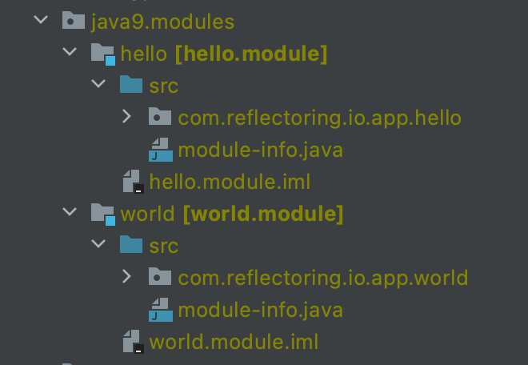

With history like Javas it would be almost impossible to write down and explain all changes made to language. 

In this article we will show all key language changes from Java 8 to Java 17. 

Intention of this article is to be single stop point for all major features that we want to go through.



## Java 8 ( https://docs.oracle.com/javase/8/docs/technotes/guides/language/enhancements.html#javase8)

Java 8 was such a revolutionary release that it put Java back on the pedistal of programming languages. Its new features helped with productivity, ease of use and readability of code. 
In this chapter we will go through some of the most important changes made to the Java language in the Java 8 release:

* [Lambda expressions](#lambda-expression)
* [Method Reference](#method-reference)
* [Default Methods](#default-methods)
* [Type Annotations](#type-annotations)
* [Repeating Annotations](#repeating-annotations)
* [Method Parameter Reflection](#method-parameter-reflection)

### Lambda Expressions
`Lambda expressions` is the new feature in Java 8 that put us a bit closer to functional programming. Java was always known for having a lot of boilerplate code, and with release of Java 8 this statement became less trues. In our next examples we will see how can we use lambdas in few different scenarios. Let us begin.

#### World before lambda expressions

We own car dealership buisness and we happen to be a software developer at the same time. To discard all the paperwork we created the webpage that should help us find all, currently available, cars. Each of our car has its model and distance run. Let us take a look how we would implement function for something like this in naive way:
```java
  public static List<Car> findCarsOldWay(List<Car> cars){
      List<Car> selectedCars = new ArrayList<>();
      for (Car car: cars) {
          if(car.kilometers < 50000){
              selectedCars.add(car);
          }
      }
      return selectedCars;
  }
```
To implement this we created static function which accepts a `List` of cars. Then, it goes through each of the car and check if distance run is below desired amount. If so we want to add that car into the new list. This new list is returned to whoever called our method.
Even though we did what we intened to, our solution will present problematic as soon as we want to add new criteria for selecting cars. We would need to write new method or find all occurances of this code and change it according with the new requirement.

#### Expanding function with new criteria
If we want to expand our selection process and say that we want only Mercedes Benz cars our function will look something like this:
```java
  public static List<Car> findCarsWithModelOldWay(List<Car> cars){
      List<Car> selectedCars = new ArrayList<>();
      for(Car car: cars){
          if(car.kilometers < 50000 && car.model.equals("Mercedes")){
              selectedCars.add(car);
          }
      }
      return selectedCars;
  }
```
We added new condition into our `if` statement. This example help us move into our next set of examples where we will see how to use `lambda expressions` on the stream API and as the method argument.

#### World after lambda expressions
We have same problem as in the [previous example](#world-before-lambda-expressions). Our client wants to find all cars with some criteria. Let us see little less rigid solution to this problem:
```java
  public interface Criteria<T>{
      boolean evaluate(T t);
  }

  public static List<Car> findCarsUsingLambdaCriteria(List<Car> cars, Criteria<Car> criteria){
      List<Car> selectedCars = new ArrayList<>();
      for(Car car: cars){
          if(criteria.evaluate(car)){
              selectedCars.add(car);
          }
      }
      return selectedCars;
  }

  List<Car> criteriaLambda = findCarsUsingLambdaCriteria(cars,
      (Car car) -> car.kilometers < 500000 && car.model.equals("Mercedes"));
```
First thing that we want to create is functional interface. We can pass that functional interface as parameter to our filtering function and call upon its method to evalueate criteria. Last row of our code shows how can we use `lambda expressions` to pass implementation of functional interface method.
More about lambda expressions can be found on [oracle page.](https://docs.oracle.com/javase/tutorial/java/javaOO/lambdaexpressions.html)

### Method Reference
#### Usecase Showcase
Our next examples will show us how to use `method reference` in Java 8. We still own our car dealership shop and we want to print out all of the cars that we have in our shop. For that we will be using `method reference`. `Method reference` allows us to call functions in classes using special kind of syntax `::`. Let us see how it is done using standard method call:
```java
  List<String> withoutMethodReference = cars.stream()
                                            .map(car -> car.toString())
                                            .collect(Collectors.toList());
```
We used `lambda expressions` to map car objects into their `string`variant. 
#### Method Reference Example
Now, let us see how to use `method reference` in same situation:
```java
  List<String> methodReference = cars.stream()
                                     .map(Car::toString)
                                     .collect(Collectors.toList());

```
Here we are , again, using `lambda expressions` but now, we are calling `toString()` method by `method reference`. We can see how it is more concise and easier to read. To read more about method reference please look into [oracle page.](https://docs.oracle.com/javase/tutorial/java/javaOO/methodreferences.html)

### Default Methods
Let's say that, in our company, build library for logging. It allows us to have *contract* for logging throughout all applications inside our company. 
Since we started as small startup it was enough just to provide `log(String message)` method that will print out message where we want. After growing we realized that we want to be able provide the timestamp of our message, so it is easily searchable throughout logs. Obviously we don't want to introduce this change and make everyone use it as soon as it is available. Every service should use it as soon as possible but , maybe, there are more important stuff to deal with that moment. 
#### Usecase showcase
For that scenario we can use `default methods` introduced in Java 8. `Default methods` allows us to fallback to default implementation if developer didn't provide implementation in the class.
Let us see how our contract looks:
```java
  public interface Logging{
      void log(String message);
  }

  public class LoggingImplementation implements Logging{

      @Override
      public void log(String message) {
          System.out.println(message);
      }
  }
```

We are creating simple interface with just one method and implementing it in `LoggingImplementation` class. 
#### Default methods usage
If we want to introduce new method inside `Logging`interface compiler will fail with exception: `Class 'LoggingImplementation' must either be declared abstract or implement abstract method 'log(String, Date)' in 'Logging'`. In our next example we can see solution to this using `default methods`: 
```java
  public interface Logging{
      void log(String message);

      default void log(String message, Date date){
          System.out.println(date.toString() + ": " + message);
      }
  }
```
We used `default` keyword on method definition and put the implementation of that method inside our interface. Now, our `LoggingImplementation` class does not fail with compiler error even though we didn't implement this new method inside of it. 
To read more about `default methods` please refer to the [oracle page](https://docs.oracle.com/javase/tutorial/java/IandI/defaultmethods.html)

### Type Annotations
Type annotations are one more feature introduced in Java 8. Even though we had annotations available before now we can use them wherever we use type. This means that we can use them on:
- local variable definition 
- constructor call
- type casting
- generics 
- throw clauses and more
For more informations about type annotations please refer to [oracle page.](https://docs.oracle.com/javase/tutorial/java/annotations/type_annotations.html)
#### Creating New Annotation
We will show several examples of how to use type annotations. First let us build the `@NotNull` annotations since we are not using any library for this:
```java
  @Target(value={TYPE_USE})
  @Retention(value=RUNTIME)
  public @interface NotNull{}
```
Here we have example of one basic annotations. For now, this annotation will do nothing, since we don't have any checking module. `TYPE_USE` target allows us to use this annotation at local variable.
#### Local Variable Definition
We have several arguments comming from command line when our app is called. First of that arguments we expect to be the desired username and we want save it into our variable called `userName`. Let us see how to ensure that our local variable doesn't end up as `null`value:
```java
  @NotNull String userName = args[0];
```
This is annotation on local variable definition and it is allowed because we used `TYPE_USE` target on our `@NotNull` annotation definition.
#### Constructor Calling
Let us imagine we want to create list of strings from our input from the command line. We want to make sure that our new list is not empty. For that we can use `@NotNull` annotation:
```java
  List<String> request = new @NotEmpty ArrayList<>(Arrays.stream(args).toList());
```
This annotation will ensure that our, newly created, list is not empty. This is perfect example of how to use type annotations on constructor.

#### Generic type
Our application is acceppting set of strings as argument, and we want save them into new `List<String> emails`. One of our requirements is that each email has to be in right format `<name>@<company>.com`. We can ensure this in two ways. First of which is by looping through all of our incoming strings and ensuring that each of those values corresponds with our desired format. 
But, if we use type annotations, we can do it really easy:
```java
  List<@Email String> emails;
```
This here is our definition of local variable emails which will accepts incoming strings in one point in time. We created, or used already created, `@Email` annotation that ensures that every record inside this list is in desired format.

### Repeating Annotations
#### Creating Repeating Annotation
Sometime annotations represents actions that we want to do on different occasions. Let us imagine we have an application with the fully implemented security. It is internal tool that we use in our company. There are different levels of the authorization and not all users can do all actions. Even though we implemented everyting carefully we want to make sure that we log every attempt of trying to do something that user is not authorized to. On each of those occasions we want to send email to owner of company and to our security admin group email. 
This is where we can use repeatable annotations:
```java
  @Repeatable(Notifications.class)
  public @interface Notify{
      String email();
  }

  public @interface  Notifications{
      Notify[] value();
  }
```
The first thing that we want to do is to create `repeating annotation`. We create it as regular annotation but we provide `@Repeatable` annotation to our definitions.

Next, let us see how is our `repeating annotation` used:
```java
  @Notify(email="admin@company.com")
  @Notify(email="owner@company.com")
  public class UserNotAllowedForThisActionException extends RuntimeException{
      final String user;

      public UserNotAllowedForThisActionException(String user){
          this.user = user;

      }
  }
```
We have our custom exception class that we will throw whenever user tries to do something that he/she is not allowed to. Our annotations to this class says that we want to notify two emails when code throws this exception.
To read more about repeating annotations please refer to [oracle page.](https://docs.oracle.com/javase/tutorial/java/annotations/repeating.html)

## Java 9
Java 9 introduced next features:
* [Java Module System](#java-module-system)
* [Try-with-resources](#try-with-resources-improvement)
* [Diamond Syntax with Inner Anonymous Classes](#diamond-syntax-with-inner-anonymous-classes)
* [Private Interface Methods](#private-interface-methods)
### Java Module System
Module is group of packages,their dependencies and resources. It provides bigger set of functionalities than packages. 
When creating the new module we need to provide several informations:
* Name
* Dependencies 
* Public Packages - by default, all packages are module private
* Services Offered
* Services Consumed
* Reflection Permissions

Without going into much of the details let us craete our first module. Inside our example we will show several options and keywords that one can use when creating module.

#### Creating modules inside IntelliJ
First, we will go with a simple example. We will build Hello World application where we print "Hello" from one module and we call second module to print "World!". Since I am working in the IntelliJ IDEA there is something that we need to understand first. IntelliJ IDEA supports its own modules. For Java modules to work each module has to correspond to the IntelliJ module. 



Here we see how we structured our packages and modules. We have two modules: `hello.module` and `world.module`. They corresponds to `hello` and `world` IntelliJ modules repectively. Inside each of them we  have created the `have module-info.java` file. This very file is defining our Java module. Inside of it we need to declare which packages we need to export and on which modules are we dependen upon.

#### Defining our first module

For this example we are going to use the `hello` module to print "Hello". Inside of it we will call method inside `world` module, which will print "World !". First thing that we need to do is to declare export of the package containing our `World.class`  inside `module-info.java`:
```java
  module world.module {
      exports com.reflectoring.io.app.world;
  }
```
We can see how one module is created. First we have keyword `module` that is followed by name of our module. We will use this name, later, for referencing this module. Next keywork that we use is `exports`. It tells us that we are making our `com.reflectoring.io.app.world` package visible outside of our module. 

There are several other keywords that can be used:
* requires
* requires transitive
* exports to
* uses
* provdies with
* open
* opens
* opens to

Out of these we will show only `requires` declaration. Others can be found on [the link.](https://www.oracle.com/corporate/features/understanding-java-9-modules.html)

#### Defining our second module
After we created and exported our `world` module we can proceed with creating `hello` module that will use previously created module and call it from its code:

```java
  module hello.module {
      requires world.module;
  }
```
After defining name of module we define our dependencies using `requires` keyword. We are referencing our, newly created, `hello.module`. Since we are not exporting anything from this module all packages are module private and cannot be seen from outside of the module. 

#### Using Java modules inside of the code
Now that we have showns how to create modules and dependencies between them, let us show how to use those modules inside of the code. We have main method inside `hello.module` that prints "Hello" to the console. We want to call method from `world.module` to print out " World!" to the console:
```java
  package com.reflectoring.io.app.hello;

  import com.reflectoring.io.app.world.World;

  public class Hello {
      public static void main(String[] args) {
          System.out.println("Hello");
          World.print();
      }
  }
```
Since `com.reflectoring.io.app.world` is exported from its module and set as required to `hello.module` we can call it as if it is inside our module. Just for reference here is how `World.print()` method looks:
```java
  package com.reflectoring.io.app.world;

  public class World {
      public static void print() {
          System.out.println(" World!");
      }
  }
```

To do this we 
- https://www.oracle.com/corporate/features/understanding-java-9-modules.html
- https://www.baeldung.com/java-9-modularity
- https://openjdk.java.net/jeps/261
### Try-with-resources Improvement
- https://docs.oracle.com/javase/tutorial/essential/exceptions/tryResourceClose.html
- https://docs.oracle.com/en/java/javase/17/language/java-language-changes.html#GUID-A920DB06-0FD1-4F9C-8A9A-15FC979D5DA3
### Diamond Syntax with Inner Anonymous Classes
- https://beginnersbook.com/2018/05/java-9-anonymous-inner-classes-and-diamond-operator/
### Private Interface Methods
- https://www.javatpoint.com/java-9-interface-private-methods
- https://www.baeldung.com/java-interface-private-methods

## Java 10
### Local Variable Type Inference
- https://docs.oracle.com/en/java/javase/17/language/local-variable-type-inference.html
- http://openjdk.java.net/projects/amber/LVTIstyle.html

## Java 11
### Local Variable Type in Lambda Expressions
- https://openjdk.java.net/jeps/323


## Java 14
### Switch Expressions
- https://docs.oracle.com/en/java/javase/14/language/switch-expressions.html


## Java 15
### Text Blocks
- https://docs.oracle.com/en/java/javase/15/text-blocks/index.html

## Java 16
### Pattern Matching fo instanceof
- https://docs.oracle.com/en/java/javase/16/language/pattern-matching-instanceof-operator.html
### Record Classes
- https://docs.oracle.com/en/java/javase/16/language/records.html

## Java 17
### Sealed Classes
- https://docs.oracle.com/en/java/javase/17/language/sealed-classes-and-interfaces.html
