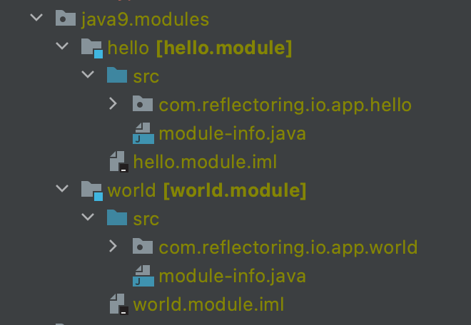

A lot has changed in Java from its beginnings in 1995 until today.
Java 8 was a revolutionary release that put Java back on the pedestal of the best programming languages.

We will go through most of the changes in the Java language that happened from Java 8 in 2014 until today. We will try to be as brief as possible on every feature. The intention is to have __a single point__ for reading through most of the features between Java 8 and Java 17 inclusively.



## Java 8

The main changes of the Java 8 release were these:

* [Lambda expressions](#lambda-expressions)
* [Method Reference](#method-reference)
* [Default Methods](#default-methods)
* [Type Annotations](#type-annotations)
* [Repeating Annotations](#repeating-annotations)
* [Method Parameter Reflection](#method-parameter-reflection)

### Lambda Expression
Java was always known for having a lot of boilerplate code. With the release of Java 8, this statement became a little less valid. 
Lambda expressions are the new feature that moves us a bit closer to functional programming. 
In our examples, we will see how we use lambdas in a few different scenarios. 

Let us begin.
#### The World Before Lambda Expressions

We own a car dealership business. To discard all the paperwork, we want to create some code that finds all currently available cars that have run less than 50,000 km. Let us take a look at how we would implement a function for something like this in a naive way:
```java
public static List<Car> findCarsOldWay(List<Car> cars){
    List<Car> selectedCars = new ArrayList<>();
    for (Car car: cars) {
        if(car.kilometers < 50000){
            selectedCars.add(car);
        }
    }
    return selectedCars;
}
```
To implement this, we a created static function which accepts a `List` of cars. It should return filtered list according to specified condition.
#### Adding Search Criteria
If we want to expand our ssearch criteria to filter only Mercedes cars, our method will look something like this:
```java
public static List<Car> findCarsWithModelOldWay(List<Car> cars){
    List<Car> selectedCars = new ArrayList<>();
    for(Car car: cars){
        if(car.kilometers < 50000 && car.model.equals("Mercedes")){
            selectedCars.add(car);
        }
    }
    return selectedCars;
}
```
We added a new condition to the `if` statement. This helps us move into our next set of examples, where we will see how to use a Lambda expression on the stream API and as the method argument.

#### The World After Lambda Expressions
We have the same problem as in the [previous example](#world-before-lambda-expressions). Our client wants to find all cars with some criteria. Let us see a little less rigid solution to this problem:
```java
public interface Criteria<T>{
    boolean evaluate(T t);
}

public static List<Car> findCarsUsingLambdaCriteria(List<Car> cars, Criteria<Car> criteria){
    List<Car> selectedCars = new ArrayList<>();
    for(Car car: cars){
        if(criteria.evaluate(car)){
            selectedCars.add(car);
        }
    }
    return selectedCars;
}

List<Car> criteriaLambda = findCarsUsingLambdaCriteria(cars,
    (Car car) -> car.kilometers < 500000 && car.model.equals("Mercedes"));
```
The first thing that we want to create is a functional interface. We can pass that functional interface as a parameter to our filtering function and call upon its method to evaluate criteria. The last line of our code shows how we use a Lambda expression to pass the implementation of the functional interface method.

More about Lambda expressions can be found in the [docs](https://docs.oracle.com/javase/tutorial/java/javaOO/lambdaexpressions.html).

### Method Reference
#### Usecase
We still own a car dealership shop, and we want to print out all cars in the shop. For that, we will use a method reference. A method reference allows us to call functions in classes using a special kind of syntax `::`. Let us see how to do it using the standard method call:
```java
List<String> withoutMethodReference = cars.stream()
    .map(car -> car.toString())
    .collect(Collectors.toList());
```
We used a Lambda expression to map the car objects into their String variant. 
#### Method Reference Example
Now, let us see how to use a Method reference in the same situation:
```java
List<String> methodReference = cars.stream()
    .map(Car::toString)
    .collect(Collectors.toList());
```
We are, again, using a Lambda expression, but now we call the `toString()` method by method reference. We can see how it is more concise and easier to read. 

To read more about method reference please look at the [docs](https://docs.oracle.com/javase/tutorial/java/javaOO/methodreferences.html).
### Default Methods
Let us imagine that we have a simple method `log(String message)` that prints log messages on invocation. We realized that we want to provide timestamps to messages so that logs are easily searchable. We don't want our clients to break after we introduce this change.
#### Usecase
For that scenario, we can use default methods. Default methods allow us to fall back to a default implementation if a developer didn't provide the implementation in the class.

Let us see how our contract looks:
```java
public interface Logging{
    void log(String message);
}

public class LoggingImplementation implements Logging{

    @Override
    public void log(String message) {
        System.out.println(message);
    }
}
```

We are creating a simple interface with just one method and implementing it in `LoggingImplementation` class. 
#### Default Methods Usage
If we want to introduce a new method `log(String, Date)` inside the `Logging` interface, the compiler will fail with this exception: 

```
Class 'LoggingImplementation' must either be declared abstract or implement abstract method 'log(String, Date)' in 'Logging'`.
``` 

The example shows the solution to this using `default methods`: 
```java
public interface Logging{
    void log(String message);

    default void log(String message, Date date){
        System.out.println(date.toString() + ": " + message);
    }
}
```
We used the `default` keyword on the method definition and put the implementation of that method inside the interface. Now, our `LoggingImplementation` class does not fail with a compiler error even though we didn't implement this new method inside of it. 

To read more about default methods please refer to the [docs](https://docs.oracle.com/javase/tutorial/java/IandI/defaultmethods.html).

### Type Annotations
Type annotations are one more feature introduced in Java 8. Even though we had annotations available before, now we can use them wherever we use a type. This means that we can use them on:
- a local variable definition 
- constructor calls
- type casting
- generics 
- throw clauses and more

#### Local Variable Definition
Let us see how to ensure that our local variable doesn't end up as `null` value:
```java
@NotNull String userName = args[0];
```
We are using annotation on the local variable definition here.
#### Constructor Call
We want to make sure that we cannot create an empty `ArrayList`:
```java
List<String> request = new @NotEmpty ArrayList<>(Arrays.stream(args).toList());
```
This is the perfect example of how to use type annotations on constructor.

#### Generic Type
One of our requirements is that each email has to be in a format `<name>@<company>.com`.
If we use type annotations, we can do it really easy:
```java
List<@Email String> emails;
```
This is a definition of a list of email addresses. We use `@Email` annotation that ensures that every record inside this list is in the desired format.

For more information about type annotations please refer to [the docs](https://docs.oracle.com/javase/tutorial/java/annotations/type_annotations.html).

### Repeating Annotations
#### Creating a Repeating Annotation
Let us imagine we have an application with fully implemented security. It has different levels of authorization. Even though we implemented everything carefully, we want to make sure that we log every unauthorized action. On each unauthorized action, we are sending an email to the owner of the company and our security admin group email. 

This is where we can use repeatable annotations:
```java
@Repeatable(Notifications.class)
public @interface Notify{
    String email();
}

public @interface  Notifications{
    Notify[] value();
}
```
The first thing that we want to do is to create a repeating annotation. We create it as regular annotation, but we provide `@Repeatable` annotation to our definitions.
#### Using Repeating Annotations

We can add a repating annotation multiple times to the same construct:
```java
@Notify(email="admin@company.com")
@Notify(email="owner@company.com")
public class UserNotAllowedForThisActionException extends RuntimeException{
final String user;

    public UserNotAllowedForThisActionException(String user){
        this.user = user;

    }
}
```
We have our custom exception class that we will throw whenever a user tries to do something that the user is not allowed. Our annotations to this class say that we want to notify two emails when code throws this exception.

To read more about repeating annotations please refer to the [docs](https://docs.oracle.com/javase/tutorial/java/annotations/repeating.html).

## Java 9
Java 9 introduced these main features:
* [Java Module System](#java-module-system)
* [Try-with-resources](#try-with-resources-improvement)
* [Diamond Syntax with Inner Anonymous Classes](#diamond-syntax-with-inner-anonymous-classes)
* [Private Interface Methods](#private-interface-methods)

### Java Module System
A module is a group of packages, their dependencies, and resources. It provides a broader set of functionalities than packages. 

When creating the new module, we need to provide several attributes:
* Name
* Dependencies 
* Public Packages - by default, all packages are module private
* Services Offered
* Services Consumed
* Reflection Permissions

Without going into many details, let us create our first module. Inside our example, we will show several options and keywords that one can use when creating a module.

#### Creating Modules Inside IntelliJ
First, we will go with a simple example. We will build a Hello World application where we print "Hello" from one module, and we call the second module to print "World!". 

Since I am working in the IntelliJ IDEA there is something that we need to understand first. IntelliJ IDEA has the concept of modules. For it to work, each Java module has to correspond to one IntelliJ module. 



We have two modules: `hello.module` and `world.module`. They correspond to `hello` and `world` IntelliJ modules, respectively. Inside each of them, we  have created the `module-info.java` file. This file defines our Java module. Inside, we declare which packages we need to export and on which modules we are dependent upon.

#### Defining our First Module

We are using the `hello` module to print the word: "Hello". Inside, we call the method inside the `world` module, which will print "World !". The first thing that we need to do is to declare export of the package containing our `World.class`  inside `module-info.java`:
```java
module world.module {
    exports com.reflectoring.io.app.world;
}
```
We use the keyword `module` with the module name to reference the module. 

The next keyword that we use is `exports`. It tells the module system that we are making our `com.reflectoring.io.app.world` package visible outside of our module. 

There are several other keywords that can be used:
* requires
* requires transitive
* exports to
* uses
* provdies with
* open
* opens
* opens to

Out of these we will show only `requires` declaration. Others can be found in the [docs](https://www.oracle.com/corporate/features/understanding-java-9-modules.html).

#### Defining our Second Module
After we created, and exported, the `world` module, we can proceed with creating `hello` module:

```java
module hello.module {
    requires world.module;
}
```
We define dependencies using `requires` keyword. We are referencing our newly created, `hello.module`. Packages that are not exported are, by default, module private and cannot be seen from outside of the module. 

To read more about Java module system please refer to [the docs](https://openjdk.java.net/jeps/261).

### Try-with-resources
Try-with-resources is a feature that enables us to declare new resources on a `try-catch` block to tell the JVM to release these resources after the code has run. The only condition is that the declared resource implements an `Autoclosable` interface.
#### Manual Closing of Resource
We want to read text using `BufferedReader`. `BufferedReader` is a closable resource, so we need to make sure that it is properly closed after use. Before Java 8 we would do it like this:

```java
BufferedReader br = new BufferedReader(new StringReader("Hello world example!"));
try {
    System.out.println(br.readLine());
} catch (IOException e) {
    e.printStackTrace();
} finally {
    try {
        br.close();
    } catch (IOException e) {
        e.printStackTrace();
    }
}
```
In `finally` block, we would call `close()`. The `finally` block ensures that the reader is always properly closed.

#### Using try-with-resource
Java 8 introduced the try-with-resource feature that enables us to declare our resource inside `try` definition. This will ensure that our closable is closed without using `finally`. Let us take a look at some example of using the `BufferedReader` to read string:
```java
final BufferedReader br3 = new BufferedReader(new StringReader("Hello world example3!"));
try(BufferedReader reader = br3){
    System.out.println(reader.readLine());
}catch (IOException e){
    System.out.println("Error happened!");
}
```
Inside `try` definition, we assigned our previously created reader to the new variable. Now we know that our reader will get closed every time.
#### Improvement upon Try-with-resource
How can we improve [the example](#improvement-on-autoclosable) from above? 

Well, defining a variable in one place only to reassign it to another inside `try` definition is a little bit of pain in the eye.
With Java 9, we got changes with which we can avoid that scenario. We will be looking into the same example of reading input string through `BufferedReader`:
```java
final BufferedReader br2 = new BufferedReader(new StringReader("Hello world example2!"));
try(br2){
    System.out.println(br2.readLine());
}
catch (IOException e){
    System.out.println("Error happened!");
}
```
Now we don't need to create a new variable only to autoclose it inside the `try-catch` block. We are using the same one from the original definition.

To read more about `try-with-resources` feature please refer to [oracle page.](https://docs.oracle.com/javase/tutorial/essential/exceptions/tryResourceClose.html)
### Diamond Syntax with Inner Anonymous Classes
#### What Java 9 Fixed
Before Java 9 we couldn't use a diamond operator inside inner anonymous class.

For our example, we will create an abstract class `AppendingString`. It has only one method that appends two strings with `-` between them. 
Since this is an abstract class, we will use the anonymous class for providing the implementation for the `append()` method:
```java
public abstract static class AppendingString<T>{
  public abstract T append(String a, String b);
}

public static void main(String[] args) {
    AppendingString<String> appending = new AppendingString<>() {
        @Override
        public String append(String a, String b) {
            return new StringBuilder(a).append("-").append(b).toString();
        }
    };

    String result = appending.append("Reflectoring", "Blog");
    System.out.println(result);
}
```
We are using the diamond operator to tell our method which type we expect.
Since we are using Java 8, in this example we will get a compiler error:

```java
java: cannot infer type arguments for com.reflectoring.io.java9.DiamondOperator.AppendingString<T>
reason: '<>' with anonymous inner classes is not supported in -source 8
    (use -source 9 or higher to enable '<>' with anonymous inner classes)
```

In Java 9, this compiler error is no longer happening.

### Private Interface Methods
We already mentioned how we use default methods in interfaces. 

How do we split the implementation into several methods? When working with classes, we can achieve it using private methods. Could that be the solution in our case? 

As of Java 9, yes. We can create private methods inside our interfaces.
#### Usage of Private Interface Methods
For our example, we want to print out a set of names. 

Interface containing this functionality had default method defined.
We decided that we should if the client doesn't provide the implementation, provide a set of predefined names that we read from the resource folder:

```java
public class PrivateInterfaceMethods {
    
    public static void main(String[] args) {
        TestingNames names = new TestingNames();
        System.out.println(names.fetchInitialData());
    }

    public static class TestingNames implements NamesInterface{
        public TestingNames(){}
    }
    
    public interface NamesInterface{
        
        default List<String> fetchInitialData(){
            try(BufferedReader br = new BufferedReader(new InputStreamReader(this.getClass().getResourceAsStream("/names.txt")))) {
                return readNames(br);
            } catch (IOException e) {
                e.printStackTrace();
                return null;
            }
            
        }
        private List<String> readNames(BufferedReader br) throws IOException {
            ArrayList<String> names = new ArrayList<>();
            String name;
            while((name = br.readLine()) != null){
                names.add(name);
            }
            return names;
        }
    }
}
```
We used `BufferedReader` to read the file containing default names that we share with the client.
To encapsulate our code and, possibly, make it reusable in other methods, we decided to move code for reading and saving names into a `List` to the separate method.
This method is private and, now, we can use it anywhere inside our interface. 

As mentioned, the main benefit of this feature inside Java 9 is better encapsulation and reusability of the code.
## Java 10
### Local Variable Type Inference
Java always needed explicit types on local variables. 

When writing and reading code, we always know which type we expect. On the other hand, a lot of the code is just types with no usability.
#### Old Way
Let us look into the example here. We want to create small a set of people, put everything in one list and then go through that list in the for loop to print out their name and last name:
```java
public void explicitTypes(){
    Person Roland = new Person("Roland", "Deschain");
    Person Susan = new Person("Susan", "Delgado");
    Person Eddie = new Person("Eddie", "Dean");
    Person Detta = new Person("Detta", "Walker");
    Person Jake = new Person("Jake", "Chambers");

    List<Person> persons = List.of(Roland, Susan, Eddie, Detta, Jake);

    for(Person person : persons){
        System.out.println(person.name + " - " + person.lastname);
    }
}
```
This is the type of code that we can see in most cases in Java. We use explicit types to make sure that we know what the method expects.
#### Implicit Typing with `var` 
Now, we will look into the same example, but using the `var` keyword that Java 10 introduced. We still want to create several person objects and put them in a list. After that, we will go through that list and print out the name of each person:
```java
public void varTypes(){
    var Roland = new Person("Roland", "Deschain");
    var Susan = new Person("Susan", "Delgado");
    var Eddie = new Person("Eddie", "Dean");
    var Detta = new Person("Detta", "Walker");
    var Jake = new Person("Jake", "Chambers");

    var persons = List.of(Roland, Susan, Eddie, Detta, Jake);

    for(var person : persons){
        System.out.println(person.name + " - " + person.lastname);
    }
}
```
We can see some of the most typical examples of using `var` type on local variables. First, we use them for defining local variables. It can be a standalone object or even a list with the diamond operator. 
From now on, Java will know how to handle it.

For more details about local type inference please visit [the docs](https://docs.oracle.com/en/java/javase/17/language/local-variable-type-inference.html).
## Java 11
### Local Variable Type in Lambda Expressions
Java 11 introduced an improvement to the previously mentioned [local type inference](#local-variable-type-inference). This allows us to use `var` inside lambda expressions.
#### Using var in Lambda
We will, again, create several persons, collect them into the list and filter out all that don't have an 'a' inside their name:
```java
public void explicitTypes(){
    var Roland = new Person("Roland", "Deschain");
    var Susan = new Person("Susan", "Delgado");
    var Eddie = new Person("Eddie", "Dean");
    var Detta = new Person("Detta", "Walker");
    var Jake = new Person("Jake", "Chambers");

    var filteredPersons = List.of(Roland, Susan, Eddie, Detta, Jake)
            .stream().filter((var x) -> x.name.contains("a")).collect(Collectors.toList());;
    System.out.println(filteredPersons);
}
```
Inside the `filter()` method we are using `var` to infer the type instead of explicitly mentioning the type. 

## Java 14
### Switch Expressions
#### Old Way of Switch Statements
We have a method where a client provides the desired month, and we return the number of days inside that month. The first thing that comes to our mind is to build it with `switch-case` statements:
```java
switch (month){
    case JANUARY, MARCH, MAY, JULY, AUGUST, OCTOBER, DECEMBER:
        days=31;
        break;
    case FEBRUARY:
        days=28;
        break;
    case APRIL, JUNE, SEPTEMBER, NOVEMBER:
        days = 30;
        break;
    default:
        throw new IllegalStateException();
}
```
We need to make sure that we put a break statement inside our case code block. Failing it will result in checking on other conditions after we match the first one.
#### Using Switch Expressions
Java 14 introduces the switch expression. They allow us to omit the `break` statement. It helps with the readability of the code and better understanding.

We will look into the same method as before. The user wants to send the month and get the number of days in that month:
```java
days = switch (month){
        case JANUARY, MARCH, MAY, JULY, AUGUST, OCTOBER, DECEMBER -> 31;
        case FEBRUARY -> 28;
        case APRIL, JUNE, SEPTEMBER, NOVEMBER ->  30;
        default -> throw new IllegalStateException();
    };
```
We are using a bit different notation in the `case` block. We are using `->` instead of the colon.

This will do the same thing as the code shown in [the previous example](#old-way-of-switch-statements).
#### The `yield` Keyword
The logic inside the `case` block can be a bit more complicated than just returning a value. For example, we want to log which month the user sent us:
```java
days = switch (month){
    case JANUARY, MARCH, MAY, JULY, AUGUST, OCTOBER, DECEMBER -> {
        System.out.println(month);
        yield 31;
    }
    case FEBRUARY -> {
        System.out.println(month);
        yield 28;
    }
    case APRIL, JUNE, SEPTEMBER, NOVEMBER -> {
        System.out.println(month);
        yield 30;
    }
    default -> throw new IllegalStateException();
};
```
In a multi-line code block, we have to use the `yield` keyword to return a value from a `case` block. 

To read more about using switch expressions please refer to the [docs](https://docs.oracle.com/en/java/javase/14/language/switch-expressions.html).

## Java 15
### Text Blocks
#### Example Without Using Text Blocks
We want to send an HTML document via email. 
For this to work, we need to store the template into a variable:
```java
  System.out.println(
          "<!DOCTYPE html>\n" +
          "<html>\n" +
          "     <head>\n" +
          "        <title>Example</title>\n" +
          "    </head>\n" +
          "    <body>\n" +
          "        <p>This is an example of a simple HTML page with one paragraph.</p>\n" +
          "    </body>\n" +
          "</html>\n");
```
We can format our string like in the example above. We need to take care of new lines and append all the lines to a single string. Java 15 introduced an easier way of doing this. It is called  text blocks.
#### Example of Using Text Blocks
Let us look into the same example of an HTML template for email. We want to send an example email with some straightforward HTML formatting. This time we will use a text block:
```java
  System.out.println(
          """
          <!DOCTYPE html>
          <html>
              <head>
                  <title>Example</title>
              </head>
              <body>
                  <p>This is an example of a simple HTML page with one paragraph.</p>
              </body>
          </html>      
          """
  );
```
We used special syntax for opening and closing quotes: `"""`. This allows us to treat our string as if we are writing it in a .txt file.

There are some rules that we need to abide by when using a text block. We need to make sure that we put a new line after our opening quotes, or our compiler will throw an error: 

```
Illegal text block start: missing new line after opening quotes.
```

If we want to end our string with `\n` we can do it by putting new line before closing `"""` like in the example above.

To read more about text blocks please refer to the [docs](https://docs.oracle.com/en/java/javase/15/text-blocks/index.html).
## Java 16
### Pattern Matching of instanceof

#### Example Without Pattern Matching
We have a base class called `Vehicle` and two classes that extend that one: `Car` and `Bicycle`.
We omitted the code for this, and you can look it up in the [GitHub repo](https://github.com/thombergs/code-examples/tree/master/core-java/versions). 

Our algorithm for calculating prices is depending on the instance of the vehicle that is sent to it:
```java
public static double priceOld(Vehicle v) {
    if (v instanceof Car) {
        Car c = (Car) v;
        return 10000 - c.kilomenters*0.01 - (Calendar.getInstance().get(Calendar.YEAR) - c.year)*100;
    } else if (v instanceof Bicycle){
        Bicycle b = (Bicycle) v;
        return 1000 + b.wheelSize*10;
    } else throw new IllegalArgumentException();
}
```
Since we are not using pattern matching, we need to cast the vehicle into the correct type inside each `if-else` block. As we can see, it is a typical example of boilerplate code for which Java is famous.
#### Using Pattern Matching
Let's see how can we can discard the boilerplate part from the example [above](#example-without-pattern-matching):
```java
public static double price(Vehicle v) { 
    if (v instanceof Car c) {
        return 10000 - c.kilomenters*0.01 - (Calendar.getInstance().get(Calendar.YEAR) - c.year)*100;
    } else if (v instanceof Bicycle b) {
        return 1000 + b.wheelSize*10;
    } else throw new IllegalArgumentException();
}
```
Pattern matching on the `instanceof` allows us to cast our variable inline and use it inside the desired `if-else` block without explicitly casting it. One thing to note is the scope of the casted variable. It's visible only in withing the if statement.

For more information about pattern matching in `instanceof` method please refer to the [docs](https://docs.oracle.com/en/java/javase/16/language/pattern-matching-instanceof-operator.html).
### Records
How many POJOs (Plain Old Java Objects) have you written?

Well, I can answer for myself: "Too many!".

Java has had a bad reputation for boilerplate code. 
Lombok allowed us to stop worrying about getters, setters, etc. Java 16 finally introduced records to remove a lot of boilerplate code.

A record class is nothing more than regular POJO, for which most of the code is generated from the definition.

#### Plain Old Java Object definition
Let us look into the example of the POJO class before Java 16 introduced records:
```java
public class Vehicle {
    String code;
    String engineType;

    public String getCode() {
        return code;
    }

    public void setCode(String code) {
        this.code = code;
    }

    public String getEngineType() {
        return engineType;
    }

    public void setEngineType(String engineType) {
        this.engineType = engineType;
    }

    public Vehicle(String code, String engineType) {
        this.code = code;
        this.engineType = engineType;
    }

    @Override
    public boolean equals(Object o) ...

    @Override
    public int hashCode() ...

    @Override
    public String toString() ...
}
```
There are almost 50 lines of code for object that contains only two properties. The IDE generated this code, but still, it is there and has to be maintained.
#### Record Definition
Definition of a vehicle record, with the same two properties, can be done in just one line:
```java
  public record VehicleRecord(String code, String engineType) {}
```
This one line has all the same getters, setters, constructors, etc. as from the example [above](#plain-old-java-object-definition).
One thing to note is that the `record` class is, by default, final, and we need to comply with that. That means we cannot extend a `record` class, but most other things are available for us.

To read more about record classes please refer to the [docs](https://docs.oracle.com/en/java/javase/16/language/records.html).
## Java 17
### Sealed Classes
The `final` modifier on a class doesn't allow anyone to extend it. What about when we want to extend a class but only allow it for some classes?

We are back at our car dealership business. We are so proud of our algorithm for calculating prices that we want to expose it. We don't want anyone using our Vehicle representation, though. It is valid just for our business. 
We can see a bit of a problem here. We need to expose class but constrain it also. 

This is where Java 17 comes into play with `sealed` classes. The sealed class allows us to make class effectively final for everyone except explicitly mentioned classes.
```java
public sealed class Vehicle permits Bicycle, Car {...}
```
We added a `sealed` modifier to our `Vehicle` class, and we had to add the `permits` keyword with a list of classes that we allow to extend it. 
After this change, we are still getting errors from the compiler. 

There is one more thing that we need to do here.

 We need to add `final`, `sealed`, or `non-sealed` modifiers to classes that will extend our class.

```java
public final class Bicycle extends Vehicle {...}
```
#### Constraints 
Several constraints have to be met for the sealed class to work:

* Permitted subclasses must be accessible by the sealed class as compile time
* Permitted subclasses must directly extend the sealed class
* Permitted subclasses must have one of the following modifiers:
  * final
  * sealed
  * non-sealed
* Permitted subclasses must be in the same Java module

More details about sealed classes can be found in the [docs](https://docs.oracle.com/en/java/javase/17/language/sealed-classes-and-interfaces.html).
